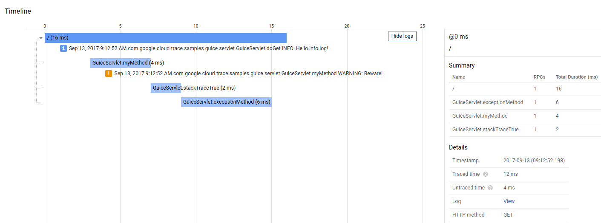

# Sample Servlet that writes Stackdriver Traces and Logs

Code in this directory gives an [example servlet](src/main/java/com/google/cloud/trace/samples/guice/servlet/GuiceServlet.java) that traces requests based on an
incoming trace context header, and adds custom spans for method calls using the
`@Span` annotation. This sample uses the [Guice](https://github.com/google/guice) dependency injection framework, but the underlying trace and logging classes it uses do not require use of Guice.

This servlet also writes logs with `java.util.logging.Logger` that are written to Stackdriver Logging using the [Google Cloud Java Client for Logging](https://github.com/GoogleCloudPlatform/google-cloud-java/tree/master/google-cloud-logging). These logs are associated with the current trace context via the sample [SpanContextLoggingEnhancer](src/main/java/com/google/cloud/trace/samples/guice/servlet/SpanContextLoggingEnhancer.java) class.

That logging enhancer sets the `LogEntry.trace` property to "projects/[PROJECT-ID]/traces/[TRACE-ID]", which enables the Stackdriver Trace Viewer to display log entries inline with trace spans (see [Viewing Trace Details, Log Entries](https://cloud.google.com/trace/docs/viewing-details#log_entries)).

## How to run this sample:

1. Go to the [API Credentials page](https://console.cloud.google.com/apis/credentials) of the Google Cloud Console, and [create a new service account key](https://console.cloud.google.com/apis/credentials/serviceaccountkey) and give it both the Cloud Trace > Cloud Trace User role and the Logging > Logs Writer role for your project. Leave the key type set to JSON and download the key.
2. Update the `src/main/webapp/WEB-INF/web.xml` file for your key. Change the `env-entry` for `clientSecretsFile` to point to the .json file for the key you just created, and change the `projectId` entry to be the project you created the key for.
3. Run `mvn install` in this folder, then `mvn jetty:run` to start the server.
4. Send a request to the servlet at `localhost:8080`, then view its trace in the [Stackdriver Trace List page](console.cloud.google.com/traces/traces). Click "Show Logs" to display the log entries for the request inline with the trace spans. You can also click the Log: View link in the "Details" section to view the log entries for the request in the Stackdriver Logs Viewer.

### Trace Screenshot with Logs

